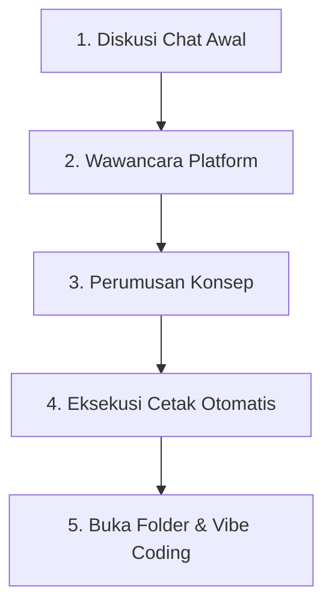

# 📖 Panduan Lengkap: Membuat Proyek Baru dengan Workflow-Factory

Selamat datang! Panduan ini dirancang khusus untuk Anda yang ingin membuat proyek perangkat lunak/keras pertama Anda **tanpa harus menulis kode secara manual** (Vibe Coding).

---

## 🎨 Alur Kerja Utama

---

## 🟢 Langkah 1: Tahap Diskusi Awal (Chat)
Saat memulai obrolan dengan AI di repositori Workflow-Factory, Anda cukup menyebutkan ide proyek dan platform Anda.

**Contoh Template Jawaban:**
> "Halo AI! Saya ingin membuat proyek:
> 1. **Ide Proyek:** Aplikasi web to-do list dengan alarm pengingat.
> 2. **Platform Utama:** Web."

---

## 🟡 Langkah 2: Wawancara Spesifik Platform
AI akan mengajukan beberapa pertanyaan lanjutan untuk memastikan kesiapan infrastruktur Anda. Jawablah sesuai kondisi asli Anda.

**Contoh Pertanyaan Lanjutan dari AI:**
- *Apakah membutuhkan database?* (Jawaban Anda: "Ya, saya ingin data tersimpan meskipun browser ditutup").
- *Bagaimana rencana hostingnya?* (Jawaban Anda: "Gunakan hosting gratis seperti Netlify atau Vercel saja").
- *Apakah butuh koneksi API/Backend?* (Jawaban Anda: "Tidak perlu backend terpisah, simpan di penyimpanan lokal browser saja").

---

## 🔵 Langkah 3: Perumusan Konsep
AI akan menyusun analisis konsep secara lengkap langsung di panel chat:
1. **PRD (Fitur):** Daftar halaman dan fungsi to-do list.
2. **Arsitektur:** Struktur file HTML, CSS, dan Javascript yang akan dibuat.
3. **Mitigasi Risiko:** Masalah apa yang sering muncul (misal: memori local storage penuh).
4. **Timeline Harian (Sprint):** Target apa saja yang dikerjakan dari Hari ke-1 sampai selesai.
5. **Skema DB / API / Deployment:** Konfigurasi khusus yang sesuai pilihan Anda.

---

## 🔴 Langkah 4: Eksekusi Cetak Otomatis (Tangan Robot)
Setelah konsep dirumuskan dan Anda menyetujuinya, AI akan memanggil **`cetak-dokumen-skill`** untuk membuat folder fisik baru di komputer Anda.

**Hasil Cetakan Fisik:**
- Folder proyek baru (misal: `i:/todo-list-app/`).
- Dokumen perancangan (`1_PRD.md`, `2_Arsitektur.md`, dll.).
- Kerangka kode kosong (Boilerplate `index.html` & `style.css`).
- Folder **`skills/`** berisi 13 skill dasar otomatis.
- File **`agents.md`** (Aturan pengembang AI untuk proyek ini).

---

## 🎯 Langkah 5: Masuk ke Proyek Baru & Mulai Vibe Coding

Setelah proyek dicetak, ikuti langkah operasional berikut di editor kode Anda:

### 1. Buka Proyek Baru
Buka VS Code atau editor Anda, lalu pilih **Open Folder** ke folder baru yang dicetak (misal: `i:/todo-list-app/`).

### 2. Jalankan Panduan Setup Lokal
Buka file `11_Panduan_Setup.md` di editor Anda. Ikuti petunjuk untuk menginstal software yang dibutuhkan (jika belum punya).

### 3. Aktifkan AI Pengembang Proyek
Buka obrolan dengan AI di proyek baru tersebut. Serahkan file `agents.md` ke AI dan katakan:
> "Baca file agents.md ini dan ikuti seluruh aturannya untuk membantu saya mengembangkan proyek ini."

### 4. Mulai Pembuatan Fitur (Gunakan Prompt Helper)
Untuk memulai menulis kode, panggil skill Prompt Helper:
> "Gunakan skills/prompt-helper-skill untuk merumuskan prompt pembuatan Halaman Utama/Beranda aplikasi."

Salin hasil prompt tersebut ke AI pembuat kode Anda, lalu jalankan aplikasinya untuk diuji.

### 5. Lacak & Update Progress
Setelah satu fitur berhasil berjalan tanpa error:
- Minta AI mencatat log aktivitas:
  > "Gunakan skills/log-skill untuk mencatat fitur yang baru kita selesaikan."
- Perbarui progress harian:
  > "Gunakan skills/sprint-update-skill untuk menandai tugas X selesai di status.md."
- Simpan perubahan ke Git:
  > "Gunakan skills/git-skill untuk commit perubahan kita ke lokal."

### 6. Menghadapi Error (Gunakan Error Solver)
Jika program Anda tiba-tiba crash atau tidak berfungsi:
- Jangan panik! Cukup salin pesan error dari terminal/console browser Anda.
- Kirim pesan ke AI:
  > "Program saya crash dengan error berikut: [paste error di sini]. Tolong gunakan skills/error-solver-skill untuk menganalisis dan memperbaikinya."

---

## 💡 Panduan Fungsi Skill & Tahap Penggunaannya

Berikut adalah rincian fungsionalitas seluruh skill bawaan proyek baru Anda beserta tahap pengoperasiannya:

### 🏗️ 1. Tahap Inisialisasi & Setup Proyek (Persiapan)
*Dijalankan saat pertama kali proyek dicetak untuk menyiapkan lingkungan coding lokal Anda.*

* **`cetak-dokumen-skill`**: Membuat folder, menyalin boilerplate kode dasar, dan menyalin seluruh 13 skill dasar dari pusat Workflow-Factory secara persis.
* **`env-setup-skill`**: Menyusun file panduan `11_Panduan_Setup.md` berisi instruksi download & instalasi editor (VS Code), runtime (Node.js/Python), dan tools lain yang dibutuhkan proyek.

### 💻 2. Tahap Perencanaan Fitur & Coding (Pengerjaan)
*Dijalankan berulang kali selama sesi "vibe coding" saat menulis kode aplikasi.*

* **`prompt-helper-skill`**: Memformulasikan instruksi mentah Anda menjadi prompt AI yang terstruktur agar AI pembuat kode tidak melantur dan memberikan kode utuh (tanpa placeholder).
* **`backup-skill`**: Membuat folder snapshot aman cadangan dari seluruh folder proyek Anda sebelum mencoba menulis kode atau update yang berisiko merusak sistem.
* **`error-solver-skill`**: Mendiagnosa stack trace error/crash dari terminal, melacak file dan baris yang rusak, serta langsung menyusun patch perbaikan kode yang benar.

### 🔍 3. Tahap Review Kualitas, Keamanan & Uji Coba (Penjaminan Mutu)
*Dijalankan setiap kali sebuah fitur selesai ditulis untuk memastikan kodenya aman dan bebas bug.*

* **`review-kode-skill`**: Membaca baris kode Anda untuk mendeteksi bad practice, logika loop bocor, code smell, dan menyarankan optimasi performa.
* **`security-audit-skill`**: Membuat `10_Security_Checklist.md` berisi daftar audit keamanan (SQL injection, HTTPS, enkripsi password, dll.) yang disesuaikan dengan platform proyek Anda.
* **`testing-skill`**: Menyusun dokumen `6_Skenario_Testing.md` berisi test case berdasarkan PRD serta menyuntikkan kerangka file uji coba otomatis (seperti Jest atau Pytest).

### 📝 4. Tahap Pendataaan Progres & Riwayat (Dokumentasi & Versi)
*Dijalankan setelah pengujian sukses untuk mencatat progres agar sejarah proyek teratur.*

* **`log-skill`**: Mengisi jurnal harian di `LOG.md` mengenai apa saja file yang diubah dan hasil pengerjaan agar progres tidak hilang arah.
* **`sprint-update-skill`**: Menandai check-box tugas di `status.md` dan mengalkulasi persentase progres proyek secara otomatis.
* **`git-workflow-skill`**: Menyusun panduan branching Git (`9_Git_Workflow.md`) dan menyiapkan filter berkas sampah `.gitignore`.
* **`git-skill`**: Mengeksekusi command Git nyata (add, commit, push, pull) untuk menyimpan kode ke lokal komputer dan mengunggahnya ke GitHub/GitLab.
* **`readme-generator-skill`**: Mengompilasi PRD menjadi file `README.md` utama yang profesional untuk dipajang di halaman depan repositori Anda.

### ⚡ 5. Skill Kondisional (Hanya Aktif Jika Relevan)
*Dijalankan hanya jika tipe proyek Anda memiliki fitur server-side, database, atau siap di-publish online.*

* **`dokumentasi-api-skill`** *(Kondisional)*: Membuat `7_Dokumentasi_API.md` berisi rincian method, parameter, dan JSON request/response jika proyek menggunakan backend API.
* **`database-schema-skill`** *(Kondisional)*: Merancang diagram relasi tabel/koleksi di `8_Database_Schema.md` jika proyek menggunakan MySQL/MongoDB/SQLite.
* **`deployment-skill`** *(Kondisional)*: Membuat file `5_Panduan_Deployment.md` berisi langkah deployment ke cPanel/VPS, flash firmware ke mikrokontroler, atau rilis apk.

---

## 🛠️ Lampiran A: Rekomendasi AI Coding Companion

Untuk menjalankan vibe coding dengan lancar, berikut adalah pilihan alat AI terbaik:

1. **Cursor Editor (Sangat Direkomendasikan)**
   - **Apa itu:** Aplikasi editor kode (seperti VS Code) yang sudah memiliki kecerdasan buatan terintegrasi secara mendalam.
   - **Kelebihan:** Sangat mudah merujuk file skill menggunakan simbol `@` (misalnya mengetik `@skills/log-skill/skill.md` langsung di panel chat Cursor).
2. **VS Code + Github Copilot / Cody**
   - Alternatif populer jika Anda ingin menggunakan VS Code standar dengan extension AI pihak ketiga.
3. **ChatGPT / Claude (Browser web)**
   - Jika Anda tidak menggunakan AI editor terintegrasi, Anda bisa menyalin isi file kode Anda dan meng-copy-paste instruksi skill secara manual ke web ChatGPT/Claude.

---

## 🔗 Lampiran B: Cara Mengarahkan AI Membaca File Skill (SOP Ignore & Hemat Token)

Untuk menghemat kuota token Anda secara drastis, direktori `/skills/` sengaja dimasukkan ke dalam daftar cek **`.cursorignore`** dan **`.windsurfignore`**. Ini membuat AI "buta" terhadap folder tersebut agar tidak membacanya berulang-ulang tanpa tujuan.

Namun, Anda tetap bisa menginstruksikan AI untuk membaca dan mengeksekusi skill tertentu dengan memanggilnya secara manual (mention) di chat editor:

* **Di Cursor Editor (Menggunakan `@`):**
  Ketik simbol `@` lalu arahkan ke file skill yang ingin dipanggil.
  > *Contoh:* "Tolong catat progres hari ini ke LOG.md menggunakan instruksi di `@skills/log-skill/skill.md`"
* **Di Windsurf Editor (Menggunakan `#`):**
  Ketik simbol `#` lalu arahkan ke file skill yang ingin dipanggil.
  > *Contoh:* "Gunakan panduan pengujian di `#skills/testing-skill/skill.md` untuk menguji fungsionalitas tombol ini"
* **Di AI Browser (ChatGPT/Claude):**
  Salin (copy) seluruh isi file `skill.md` yang Anda butuhkan, lalu tempel (paste) ke dalam chat.
  > *Contoh:* "Gunakan instruksi skill berikut: [paste isi file skill.md]. Sekarang, catat progres hari ini ke LOG.md."

---

## 🛡️ Lampiran C: Aturan Keamanan Vibe Coding

* 🛡️ **JANGAN PERNAH** memberikan atau mengunggah file `.env` yang berisi password database, API key rahasia, atau kredensial hosting ke obrolan AI publik.
* 🛡️ **JANGAN PERNAH** melakukan commit/push file konfigurasi rahasia tersebut ke GitHub publik. Pastikan file `.env` tercantum di dalam `.gitignore`.
* 💡 **Solusi:** Selalu minta AI menggunakan variabel samaran (placeholder) seperti `YOUR_API_KEY_HERE` saat menulis kode, lalu Anda isi nilainya secara manual di komputer Anda.

---

Selamat! Anda sekarang memiliki panduan taktis lengkap untuk memanfaatkan Workflow-Factory. 🎬🚀
